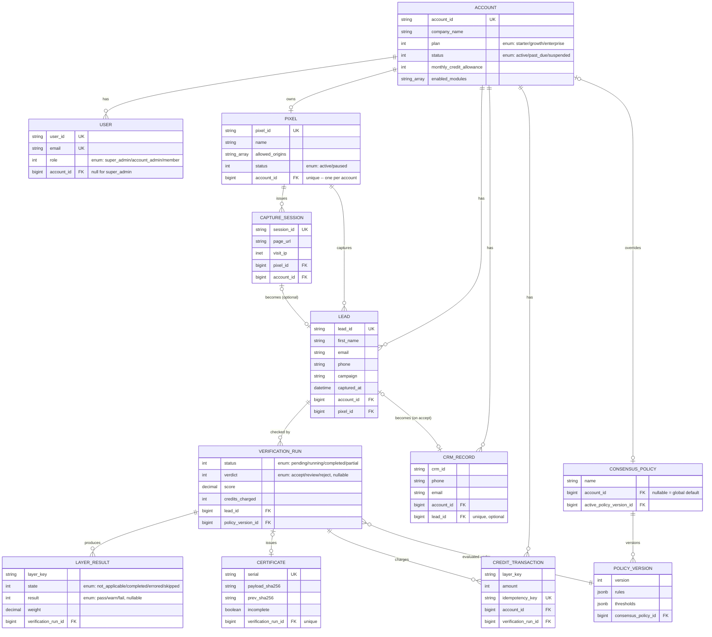

# SOLUTION.md — Super Pixel

## Tech stack


|                 |                                                                           |
| --------------- | ------------------------------------------------------------------------- |
| Language        | Ruby 3.2.2                                                                |
| Framework       | Rails 7.2.3.2                                                             |
| Database        | PostgreSQL 14                                                             |
| Background jobs | Sidekiq 8.1.7 + Redis 7 (job queue **and** the real-time pub/sub channel) |
| Auth            | Devise 5.0.4 (authentication) + Pundit 2.5.2 (authorization/scoping)      |
| Frontend        | Server-rendered ERB + Sprockets for CSS                                   |
| Rate limiting   | Rack::Attack 6.8.0                                                        |
| App server      | Puma 8.0.2                                                                |
| Tests           | RSpec-Rails 8.0.4 + FactoryBot 6.5.1                                      |
| Linting         | Rubocop (Rails Omakase config)                                            |


## Folder structure

```
app/
├── controllers/
│   ├── admin/               # super_admin-only pages
│   ├── api/pixel/           # the pixel's own endpoints: /visit, /leads, /activity
│   ├── leads_controller.rb  # the CRM (index/show)
│   └── pixels_controller.rb # pixel management (show/new/create)
├── models/                  # validations, associations, model-owned behavior only
├── policies/                # Pundit - one per resource that needs tenant scoping
├── services/
│   ├── layers/               # one adapter class per detection layer
│   ├── verification/         # Runner (starts a run), RunLayer, ActivityPublisher (SSE)
│   └── certificates/         # Issuer, Verifier
├── jobs/verification/        # RunLayersJob - the one Sidekiq job per lead
├── views/                    # ERB templates, one folder per controller
└── assets/stylesheets/       # plain CSS, one file per page

config/                       # routes, initializers (sidekiq, rack-attack, devise)
db/
├── migrate/                  # one migration per model/change
├── schema.rb
└── seeds.rb                  # loads mock-data/, then runs all 12 leads through the real pipeline

docs/                         # the assignment's own spec docs (read-only reference)
mock-data/                    # the provided fixtures (leads, accounts, users, CRM, providers)
examples/                     # the reference pixel + landing page, edited in place to point at
                              # the real endpoint     
public/                       # the same two files, copied here because Rails only serves static
                              # files from public/ (http://localhost:3000/landing-page.html)
spec/                         # covers test cases
```

## 1. How to run it

**Prerequisites**: PostgreSQL and Redis installed and running locally.

```bash
bundle install
cp .env.example .env
bin/rails db:create db:migrate
bin/rails db:seed          # loads mock-data/, then runs all 12 leads through the real pipeline
bundle exec sidekiq        # separate terminal
bin/rails server            # separate terminal
```

`.env.example` documents 3 settings:

- `REDIS_URL` — defaults to `redis://localhost:6379/0` if unset.
- `SEED_USER_PASSWORD` — a fixed login password for every seeded user. Left unset, `db:seed` generates a random one each run and prints it.
- `DEMO_PIXEL_ORIGIN` — **needed for the live demo to work locally.** Each seeded pixel's `allowed_origins` is set to that account's fictional landing-page domain from the mock data (e.g. `https://solar-savings.example.com`) which is a fake, unreachable URL. The actual demo page is served by this app itself, at `http://localhost:3000/landing-page.html`, so a real browser submitting it sends `no origin` — which won't match that fictional domain.
**Why this is a local-only concern, not a real deployment concern**: it only exists because, locally, the landing page and the Rails API are served from the exact same origin (`http://localhost:3000` for both). In a real deployment, the buyer's landing page lives on *their* domain and the pixel calls a different one (our API's domain) — a real cross-origin request. Browser will reliably attach a real `Origin` header on cross-origin calls (a cross-origin `fetch()` POST, and a cross-origin `EventSource` GET too. `DEMO_PIXEL_ORIGIN` would never come into play in production.

Seeding prints a verdict-vs-hint table for all 12 leads.

- **Demo landing page**: `http://localhost:3000/landing-page.html` — real pixel embed, `data-endpoint` pointed at Super Pixel's Rails endpoint. The activity panel streams real layer results back over SSE.
- **Operator app**: `http://localhost:3000/` (redirects to sign-in first)
- **Certificate verification** (no login needed): `http://localhost:3000/verify/:serial`

**Logins** (password printed at seed time, or set `SEED_USER_PASSWORD` for a fixed one):


| Email                           | Role          | Account                                                        |
| ------------------------------- | ------------- | -------------------------------------------------------------- |
| `admin@catchingconsent.example` | super_admin   | —                                                              |
| `dana@solarpro.example`         | account_admin | SolarPro                                                       |
| `luis@solarpro.example`         | member        | SolarPro                                                       |
| `priya@medicareedge.example`    | account_admin | Medicare Edge                                                  |
| `tom@medicareedge.example`      | member        | Medicare Edge                                                  |
| `chris@autoinsure.example`      | account_admin | AutoInsure (past-due, near-zero credits — the flagged account) |


---

## 2. Data model

`Account` → `User`s, `Pixel` (one each per account), `Lead`s, `CrmRecord`s, `CreditTransaction`s, `ConsensusPolicy`. `Pixel` → `CaptureSession`s → `Lead`. A `Lead` can have **more than one** `VerificationRun` (a person can submit twice); each run belongs to one `PolicyVersion` (the rules it was judged under so old certificates stay reproducible even after policy changes). A run has many `LayerResult`s and at most one `Certificate`.

**A** `VerificationRun` **is its own row not a status on** `Lead` — a lead is "a submission," a run is "one pass of the engine over it."  




*(Key/representative fields per table. This table does not specify every column.)*

**The three layer states, kept distinct**:

- **not-enabled** — the account never enabled this layer. No `LayerResult` row is written for a layer outside `enabled_modules_snapshot`. Enabled modules vary account wise. No row, no charge for a module not enabled for an account.
- **not-applicable** — the layer ran but doesn't apply to this lead (e.g. `voice` with no sample). A real `LayerResult` row, `state: not_applicable`, no credit charge. Decided **per-lead** by that lead's own data, not by an account-level setting.
- **completed** — the layer ran and returned pass/warn/fail, scored normally.

---

## 3. Consensus engine

Consensus engine uses layer by layer weights to derive one final verdict per each verification run. In any layer, which signals are hard stops, which are weighted, and how severe each weighted signal is, it is not hardcoded in the code — they're all conditions read from `PolicyVersion#rules` (jsonb), a versioned database record.  
`ConsensusEngine`/the layer adapters just evaluate whatever that record says. Right now, every seeded account resolves to the same one global default `PolicyVersion` — but the lookup (`ConsensusPolicy.active_version_for`) checks for a per-account override first, so a buyer-specific policy is a data insert away. (we can give this option to the account admin to configure per account policies as a part of the features we build in the future)

**Here is the per-layer breakdown of the hard stops and weighted signals**:


| Layer                                         | Hard stop — which raw field it comes from                                                                                                                  | Weighted signal                                                                                                                                                                                               |
| --------------------------------------------- | ---------------------------------------------------------------------------------------------------------------------------------------------------------- | ------------------------------------------------------------------------------------------------------------------------------------------------------------------------------------------------------------- |
| Blacklist Alliance                            | mock field `status`, value `litigator`                                                                                                                     | same field, value `suspected`                                                                                                                                                                                 |
| DNC                                           | mock field `dnc_status`, values `dnc_listed` / `internal_dnc.`                                                                                             | **none, on purpose** — DNC status is binary by what it represents: a number either is or isn't on the registry, there's no "partially on the Do-Not-Call list." Nothing to grade, so no weighted tier exists. |
| TrustedForm                                   | mock field `status`, values `mismatch` / `expired` / `not_found`                                                                                           | **none, on purpose** — this layer answers "does valid proof of consent exist," and proof is binary: it's either intact and current, or it isn't. so there's no middle ground to weight.                       |
| Anura                                         | mock field `invalid_traffic_type`, value `bot`                                                                                                             | derived from the `rule_ids` array (device reputation, fraud-farm cluster, etc.), each weight scaled by the fixture's own `confidence` value                                                                   |
| Voice                                         | mock field `verdict`, values `human_reused_actor` / `synthetic`                                                                                            | **none, on purpose** — once a reused voiceprint or synthetic voice is actually detected, that's already a confirmed technical fact, every other value of verdict is a pass.                                   |
| Duplicate detection                           | **not a provider fixture field at all** — computed live by our own code: an exact match on this account's own `crm_records` (same `phone` **and** `email`) | a soft match (`phone` **or** `email` only) — 0.05                                                                                                                                                             |
| VPN/proxy, phone/email validation, enrichment | —                                                                                                                                                          | always weighted; disagreement between providers is the signal, not any single opinion                                                                                                                         |


**Algorithm**: collect every `completed` layer's signals first (completed layer means layer executed successfully no matter the result i.e, hard stop, weighted, all clear) → check completed layer results → any hard stop → **REJECT** with that stop's reason (even if one layer hits a hard stop, all other layers results are still determined for complete certificate creation for any lead). Otherwise score is computed. `score = 1.0 − Σ(each layer's own weighted contribution)` → If it is below the value of`reject` threshold (0.4) → REJECT; below `review` threshold (0.9) → REVIEW; else ACCEPT. Thresholds and every weight live in `PolicyVersion#rules`/`#thresholds` (jsonb) — **data driven policy, not code**.

**Weights are graded by severity, not flat per layer — how one layer's own contribution is actually computed:**

1. **Each specific signal within a layer has its own weight** chosen by how bad that specific thing is — not one flat number per layer. E.g. `vpn_proxy`'s own signals: `tor_exit` (0.35) > `proxy_detected` (0.25) > `vpn_detected` / `datacenter_ip` / `ip_mismatch` (0.15 each). A Tor exit node is treated as worse evidence than a generic commercial VPN.
2. **Multiple signals from the same layer can co-occur and add up** — a lead that's both on a datacenter IP *and* has a visit/submit IP mismatch accumulates both weights, not just the worse one. `anura` additionally scales each fired signal by the provider's own reported `confidence`, so a low-confidence flag counts for less than a high-confidence one.
3. **Each layer's own total is capped** (`max_weight` — e.g. 0.5 for `vpn_proxy`/`email_validation`, 0.4 for `anura`), so a single layer that fires several signals at once still can't alone tank the whole run past s specific value. The cap is computed inside that layer's own adapter, before the result is even stored — `ConsensusEngine` just sums up whatever each layer already decided.

So the full picture: **run score = 1.0 − Σ(each completed layer's own severity-weighted, confidence-scaled, per-layer-capped total)** — three separate severity dimensions (which specific signal, how many co-occurred, how confident the provider was), not a single flat per-layer penalty.

**Unavailable/errored layers — two different behaviors, not one global rule**:

- A **critical** layer (anything the active policy gives a hard-stop rule, plus duplicate detection always) that errors marks the run at **REVIEW** — never accepts, never auto-rejects.
- A **non-critical** layer that errors is currently scored as if it said nothing (fail-open) — a known, documented trade-off, not an oversight (see §10).
- Running out of credits mid-run is modeled as the *same* `errored` state as a genuine provider failure, so both cases hit the same rule.

**Hard vs soft duplicate, handled differently on purpose**: an exact match (same phone **and** email in this account's CRM) short-circuits the run immediately — REJECT, zero credits spent in this case.   
A soft match (only one field matches) does **not** short-circuit — the full run still executes, so a human reviewing it has complete context, and it only costs 0.05 of score (L-1012: a soft duplicate with everything else clean still lands ACCEPT). The soft-match weight is currently flat regardless of how recent the matching record is or which field matched — a refinement I'd make next (§10), not built right now.

---

## 4. Multi-tenancy & authorization

Every tenant table carries `account_id`. Every controller reaches records through Pundit's `policy_scope`/`authorize` — `super_admin` lives only in `Admin::` Regular policies (`LeadPolicy`, `PixelPolicy`) grant `relevant users` access for the viewing leads and managing pixel.

---

## 5. Credits & subscriptions

**A credit is spent per layer actually executed** on a run, not per lead and not per run.   
Why per-layer: a lead that hits an early hard stop (exact duplicate) does not pay for anything.   
Charging only happens **after** a layer's adapter completes its execution, never before — so a layer that's skipped/not applicable is never billed for work that didn't happen.   
Charging is idempotent (`idempotency_key: "run_id:layer_key"`) so a crash between charging and saving the result never double-charges.

**Out of credits mid-verification — the reasoning behind the final rule:**  
The first version I implemented simply checked "is the balance above zero." That's not good enough: a balance of 1 credit is technically positive, but starting a run in that state just burns the account's last credit on a run that can't even finish its critical layers (those that have hard stops), leaving an unresolved, wasted charge behind.   
The rule that I implemented instead: **before creating anything**, sum the cost of every layer this account's active policy treats as critical (hard-stop layers, plus duplicate detection), and refuse with `402` unless the balance covers *all of them*. Nothing is created on refusal — no `Lead`, no `Run`, no charge. We can log these cases in the Activity log though which is not implemented in this version. This strategy is stricter than "balance > 0," because starting a run that'll eventually run out of credits on its most important checks and uses 1 credit for just email verification did not feel right. 

**One known, unfixed edge in this design**: the pre-flight check confirms the balance covers the critical layers' *total* cost only, but layer dispatch order isn't currently sorted to run critical layers first — it runs `duplicate_detection` first, then the rest in whatever order the account's `enabled_modules_snapshot` lists them. So, a non-critical layer dispatched before a critical one could spend down part of the credit first. So, ordering critical layers/preffered layers as per each account's policy rules is an improvement I'd make next here so credits are strictly evaluated based on that order.

---

## 6. Consent certificates

Canonical JSON payload (verdict, score, reasons, retained TrustedForm reference) → SHA-256 → linked to the previous certificate for that account (hash chain) → HMAC-signed. Immutable once issued — no update route, and a model-level `before_update` raises even from the console. Publicly retrievable/verifiable at `/verify/:serial` with no login (a certificate is meant to be handed to a third party to defend a lead), and tamper-evidence: mutating the stored payload, the signature, or the chain link each independently fails verification.

---

## 7. Real-time transport

**SSE (Server-Sent Events) over Redis pub/sub**, not ActionCable/WebSocket, not polling.


|                 | SSE (chosen)                                                                    | WebSocket/ActionCable                                                      | Short-polling                                            |
| --------------- | ------------------------------------------------------------------------------- | -------------------------------------------------------------------------- | -------------------------------------------------------- |
| Latency         | Near-instant, push-based                                                        | Near-instant                                                               | Bounded by poll interval                                 |
| Connection cost | One HTTP connection, one direction                                              | One persistent bidirectional socket per client, more server-side machinery | No held connection, but repeated request overhead        |
| Complexity      | Plain `EventSource` in the browser, a controller streaming a Redis subscription | Channel classes, connection auth, broadcasting adapter                     | Trivial client, but wastes requests when nothing changed |
| Reconnection    | Browser's `EventSource` auto-reconnects natively                                | Needs explicit reconnect handling                                          | N/A (no persistent connection to lose)                   |


The pixel only ever needs **server → browser** updates for one lead — it never needs to send anything back over the same channel. WebSocket/ActionCable's bidirectionality buys nothing here and costs a whole extra subsystem (channels, connection identification, broadcast plumbing) for a one-way need. SSE gets free auto-reconnect from the browser and degrades gracefully. Traded away: WebSocket's bidirectional channel (unneeded) and ActionCable's built-in broadcasting helpers (small win, not worth the added machinery for one-way data).

---

## 8. Pixel security

- **Cross-account posting**: the account is resolved server-side from the `Pixel` row looked up by `pixel_id`, **never** trusted from the request body — a forged `account_id` in the payload has no effect. Origin is also checked against that pixel's `allowed_origins` allowlist for `/visit` and `/leads`, where a browser reliably sends a real `Origin` header on a `fetch()` POST.
- **Abuse/replay**: Rack::Attack rate-limits all three pixel endpoints per IP (`/visit`: 60/min, `/leads`: 10/min, `/activity`: 20/min). The activity stream (`GET /activity`, an `EventSource`) is protected: a plain same-origin `GET` commonly carries no `Origin` header at all (standard browser behavior — a cross-origin `GET`/`EventSource` gets an `Origin` header, since CORS enforcement depends on it). Locally, the demo page and this API share one origin (§1's `DEMO_PIXEL_ORIGIN` note), so that's exactly the case we hit. With no `Origin` sent, `allowed_origin?`'s fallback (`request.headers["Origin"].presence || request.base_url`) can't meaningfully check anything, but it compares the server's own host to itself, which always passes. The real gate on this endpoint is the signed, 1-hour-expiring `Rails.application.message_verifier` token. Without a valid token the stream is refused regardless of origin.

---

## 9. Architecture & boundaries

Controllers only authenticate, authorize, extract params, call one service, and render — no business logic in them. Multi-step orchestration (`ConsensusEngine`, `Verification::Runner`, `Certificates::Issuer`) lives in single-purpose PORO services under `app/services/`, each independently unit-testable without a real request. Models hold validations, associations, and genuinely model-owned behavior (`Account#credits_remaining`) — not a junk drawer of unrelated methods. No `default_scope`, no business logic hidden in callback chains — the flow is traceable by reading the orchestrating service top to bottom, not by hunting `after_save` hooks.

---

## 10. What I stubbed, known gaps, and what I'd build next

**Stubbed / cut, and why:**

- **Lead outside the 12 fixtures** — a lead identity outside the 12 fixtures still gets a real `duplicate_detection` check (it's a live database query, not a fixture lookup, so it works for anyone). The other 9 layers need a real vendor call to answer for someone we have no fixture for, which is out of scope here — so those layers land as `errored` for a brand-new identity, and the run floors at REVIEW rather than crashing. Workaround for a live demo: submit one of the 12 known identities.
- **No persisted activity/audit log.** The real-time stream (Redis pub/sub → SSE) is live and working, but nothing is stored for later review — there's no way to browse "what happened, when" for a lead after the live session ends. The per-layer breakdown on the CRM lead page covers most of the same ground for the engine's side, but the pixel's own side (visit/session events) isn't persisted anywhere.
- **Manual REVIEW resolution** — an admin/account admin should be able to accept/reject a REVIEW lead; not built yet.
- **Soft-duplicate scoring is flat** (0.05 regardless of recency or which field matched) — a real refinement (weight the match by how recently the CRM record was created, and by which field) documented but not built.
- **Errored non-critical layers score as "no signal"** (fail-open) — important checks must work or we pause, small checks can skip if they break. This can be handled in a better way, maybe by assigning some weight to the errored non-critical layers.
- **Account-specific policy rules / tuning the engine** — adding an option for the account admin to configure policy rules, so we can have a policy version per account with its own preference of layers/weights/acceptance/rejection thresholds. We can also add compound rules for cross-layer checking — for example, if an account decides that both email and phone verification failing together should be a hard stop. This would be treated as a cross-layer validation.

**First thing I'd build with another week**: account-specific policy rule configuration, and a manual review process for leads sitting in REVIEW state.

---

## 11. Design Questions — index

Answered above; short pointers here rather than repeating:

1. Core models/relations, where a run lives → §2.
2. Three layer states kept distinct → §2.
3. Hard stops vs weighted, and why → §3 table.
4. N layer results → verdict + reason → §3 algorithm.
5. Fail-open vs fail-closed on unavailable layers → §3.
6. Buyer tuning the engine; policy is data → §3
7. Query-layer account isolation → §4.
8. `super_admin` separation → §4.
9. When a credit is consumed, and why → §5.
10. Zero credits mid-verification, dashboard warning → §5.
11. Certificate contents and tamper-evidence → §6.
12. Sync vs background jobs → one job per lead (`Verification::RunLayersJob`, Sidekiq), not one job per layer: every layer here is a fast local fixture read (microseconds), so fanning out per layer would multiply job/queue overhead ~10x for zero real parallelism benefit — there's no slow I/O to overlap. Kept off the request thread regardless, so pixel ingestion latency never depends on it.
13. Real-time transport choice and trade-off → §7.
14. Next week + biggest risk → §10.

